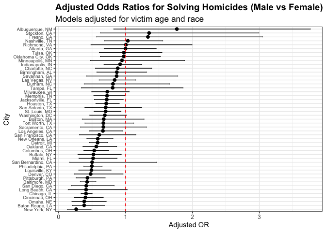
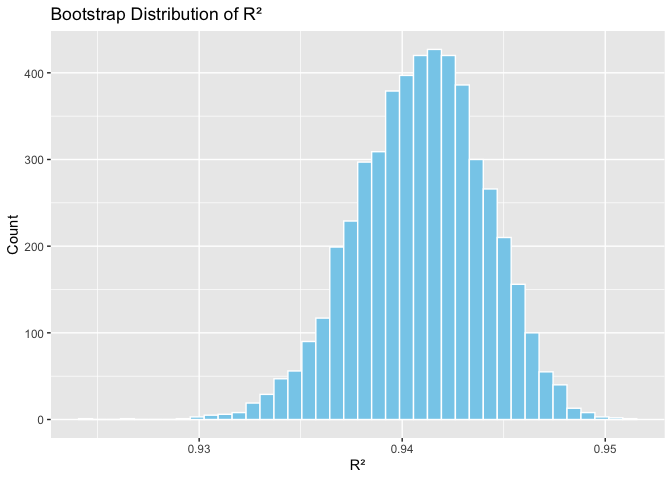
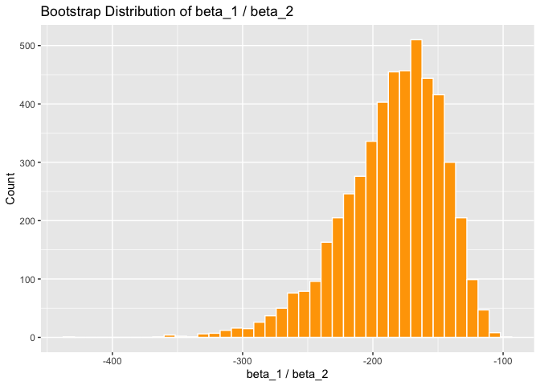
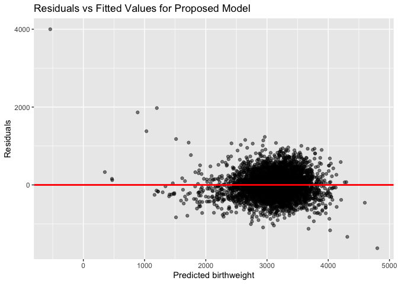

P8105_hw6_jg5037
================
Jian Gao-jg5037
2025-11-30

- [Problem 1](#problem-1)
  - [Problem 1(b) Answer:](#problem-1b-answer)
  - [Problem 1(c) Answer:](#problem-1c-answer)
  - [comments on results:](#comments-on-results)
- [Problem 2](#problem-2)
  - [Problem 2(a) Answer:](#problem-2a-answer)
  - [Problem 2(b) Answer:](#problem-2b-answer)
  - [Problem 2(c) Answer:](#problem-2c-answer)
  - [comments on results:](#comments-on-results-1)
- [problem 3](#problem-3)
  - [Problem 3(a) Answer:](#problem-3a-answer)
  - [Problem 3(b) Answer:](#problem-3b-answer)
    - [comment results](#comment-results)
  - [Problem 3(c) Answer:](#problem-3c-answer)
    - [comment results](#comment-results-1)

# Problem 1

``` r
# load data
homicide_raw <- read_csv("datasets/homicide_data.csv")

homicide_df <-
  homicide_raw %>%
  mutate(
    city_state = str_c(city, ", ", state),
    solved = if_else(disposition == "Closed by arrest", 1, 0),
    victim_age = suppressWarnings(as.numeric(victim_age))
  ) %>%
  filter(
    !city_state %in% c("Dallas, TX", "Phoenix, AZ", "Kansas City, MO", "Tulsa, AL"),
    victim_race %in% c("White", "Black")
  )
```

``` r
# Problem 1(a)
# Baltimore logistic regression
baltimore_mod <-
  homicide_df %>%
  filter(city_state == "Baltimore, MD") %>%
  glm(
    solved ~ victim_age + victim_sex + victim_race,
    data = .,
    family = binomial(link = "logit")
  )

baltimore_res <-
  baltimore_mod %>%
  tidy(conf.int = TRUE, exponentiate = TRUE)

baltimore_res %>%
  filter(term == "victim_sexMale") %>%
  select(term, estimate, conf.low, conf.high)
```

    ## # A tibble: 1 × 4
    ##   term           estimate conf.low conf.high
    ##   <chr>             <dbl>    <dbl>     <dbl>
    ## 1 victim_sexMale    0.426    0.324     0.558

## Problem 1(b) Answer:

``` r
city_OR <-
  homicide_df %>%
  group_by(city_state) %>%
  nest() %>%
  mutate(
    model = map(data, ~ glm(
      solved ~ victim_age + victim_sex + victim_race,
      data = .x,
      family = binomial(link = "logit")
    )),
    res = map(model, ~ tidy(.x, exponentiate = TRUE, conf.int = TRUE))
  ) %>%
  unnest(res) %>%
  filter(term == "victim_sexMale") %>%
  select(city_state, estimate, conf.low, conf.high) %>%
  mutate(city_state = as.character(city_state)) # make sure it's as character
city_OR
```

    ## # A tibble: 47 × 4
    ## # Groups:   city_state [47]
    ##    city_state      estimate conf.low conf.high
    ##    <chr>              <dbl>    <dbl>     <dbl>
    ##  1 Albuquerque, NM    1.77     0.825     3.76 
    ##  2 Atlanta, GA        1.00     0.680     1.46 
    ##  3 Baltimore, MD      0.426    0.324     0.558
    ##  4 Baton Rouge, LA    0.381    0.204     0.684
    ##  5 Birmingham, AL     0.870    0.571     1.31 
    ##  6 Boston, MA         0.674    0.353     1.28 
    ##  7 Buffalo, NY        0.521    0.288     0.936
    ##  8 Charlotte, NC      0.884    0.551     1.39 
    ##  9 Chicago, IL        0.410    0.336     0.501
    ## 10 Cincinnati, OH     0.400    0.231     0.667
    ## # ℹ 37 more rows

## Problem 1(c) Answer:

``` r
city_OR %>%
  ggplot(aes(
    x = estimate,
    y = forcats::fct_reorder(city_state, estimate)
  )) +
  geom_point(size = 2) +
  geom_errorbarh(aes(xmin = conf.low, xmax = conf.high), height = 0.2) +
  geom_vline(xintercept = 1, linetype = "dashed", color = "red") +
  labs(
    title = "Adjusted Odds Ratios for Solving Homicides (Male vs Female)",
    subtitle = "Models adjusted for victim age and race",
    x = "Adjusted OR",
    y = "City"
  ) +
  theme_bw() +
  theme(
    axis.text.y = element_text(size = 7),
    axis.text.x = element_text(size = 9),
    plot.title = element_text(size = 14, face = "bold"),
    plot.subtitle = element_text(size = 13)
  )
```

<!-- -->

## comments on results:

The plot shows that most cities have odds ratios below or close to 1,
meaning there isn’t strong evidence that male victims are more likely to
have their cases solved after adjustment. A few cities on the top have
ORs above 1, but many of their intervals are wide, so the estimates are
uncertain. Overall, the effect of victim sex on case clearance appears
small and varies across cities.

# Problem 2

``` r
data("weather_df")

weather_df =
  p8105.datasets::weather_df %>%
  as.data.frame() %>%
  as_tibble() %>%
  ungroup()

head(weather_df)
```

    ## # A tibble: 6 × 6
    ##   name           id          date        prcp  tmax  tmin
    ##   <chr>          <chr>       <date>     <dbl> <dbl> <dbl>
    ## 1 CentralPark_NY USW00094728 2021-01-01   157   4.4   0.6
    ## 2 CentralPark_NY USW00094728 2021-01-02    13  10.6   2.2
    ## 3 CentralPark_NY USW00094728 2021-01-03    56   3.3   1.1
    ## 4 CentralPark_NY USW00094728 2021-01-04     5   6.1   1.7
    ## 5 CentralPark_NY USW00094728 2021-01-05     0   5.6   2.2
    ## 6 CentralPark_NY USW00094728 2021-01-06     0   5     1.1

## Problem 2(a) Answer:

``` r
# linear regression model
model_fit <- lm(tmax ~ tmin + prcp, data = weather_df)

tidy(model_fit)
```

    ## # A tibble: 3 × 5
    ##   term        estimate std.error statistic  p.value
    ##   <chr>          <dbl>     <dbl>     <dbl>    <dbl>
    ## 1 (Intercept)  7.78     0.0854       91.0  0       
    ## 2 tmin         1.02     0.00558     182.   0       
    ## 3 prcp        -0.00558  0.000593     -9.41 1.21e-20

``` r
glance(model_fit)
```

    ## # A tibble: 1 × 12
    ##   r.squared adj.r.squared sigma statistic p.value    df logLik    AIC    BIC
    ##       <dbl>         <dbl> <dbl>     <dbl>   <dbl> <dbl>  <dbl>  <dbl>  <dbl>
    ## 1     0.941         0.941  2.73    17245.       0     2 -5259. 10526. 10549.
    ## # ℹ 3 more variables: deviance <dbl>, df.residual <int>, nobs <int>

## Problem 2(b) Answer:

``` r
weather_df = weather_df |>
  drop_na(tmax, tmin, prcp)

# Bootstrap 5000 samples
set.seed(1)
boot_samples <-
  weather_df |>
  modelr::bootstrap(5000)

# Fit model on each bootstrap sample
boot_results <-
  boot_samples |>
  mutate(
    models  = map(strap, \(df) lm(tmax ~ tmin + prcp, data = df)),
    glance  = map(models, glance),
    tidyres = map(models, tidy)
  ) |>
  mutate(
    r2 = map_dbl(glance, \(g) g$r.squared),
    beta_ratio = map_dbl(tidyres, \(t) {
      b1 <- t$estimate[t$term == "tmin"]
      b2 <- t$estimate[t$term == "prcp"]
      b1 / b2
    })
  ) |>
  select(r2, beta_ratio)

boot_results
```

    ## # A tibble: 5,000 × 2
    ##       r2 beta_ratio
    ##    <dbl>      <dbl>
    ##  1 0.941      -205.
    ##  2 0.937      -229.
    ##  3 0.945      -164.
    ##  4 0.942      -167.
    ##  5 0.943      -178.
    ##  6 0.942      -159.
    ##  7 0.939      -176.
    ##  8 0.939      -227.
    ##  9 0.938      -162.
    ## 10 0.935      -201.
    ## # ℹ 4,990 more rows

## Problem 2(c) Answer:

``` r
# Compute 95% CI
r2_ci = quantile(boot_results$r2, probs = c(0.025, 0.975))
ratio_ci = quantile(boot_results$beta_ratio, probs = c(0.025, 0.975))

r2_ci
```

    ##      2.5%     97.5% 
    ## 0.9344957 0.9467211

``` r
ratio_ci
```

    ##      2.5%     97.5% 
    ## -274.7945 -125.4836

``` r
# r² distribution
ggplot(boot_results, aes(x = r2)) +
  geom_histogram(bins = 40, fill = "skyblue", color = "white") +
  labs(
    title = "Bootstrap Distribution of R²",
    x = "R²", y = "Count"
  )
```

<!-- -->

``` r
# beta1 / beta2 distribution
ggplot(boot_results, aes(x = beta_ratio)) +
  geom_histogram(bins = 40, fill = "orange", color = "white") +
  labs(
    title = "Bootstrap Distribution of beta_1 / beta_2",
    x = "beta_1 / beta_2", y = "Count"
  )
```

<!-- -->

## comments on results:

The bootstrap distribution of r² is fairly concentrated, and the 95%
interval shows that the model explains a stable amount of variation in
daily maximum temperature.

For β₁/β₂, the distribution is wider and more skewed, suggesting more
uncertainty in the relative effects of tmin and precipitation.

Overall, the bootstrap results indicate that tmin is a much stronger
predictor of tmax than prcp, and most of the uncertainty in the ratio
comes from the precipitation coefficient.

# problem 3

## Problem 3(a) Answer:

``` r
birthweight <- read_csv("datasets/birthweight.csv")
bw_df <-
  birthweight |>
  clean_names() |>
  mutate(
    babysex = factor(babysex, levels = c(1, 2), labels = c("male", "female")),
    frace = recode_factor(
      frace,
      `1` = "White",
      `2` = "Black",
      `3` = "Asian",
      `4` = "Puerto Rican",
      `8` = "Other",
      `9` = "Unknown"
    ),
    mrace = recode_factor(
      mrace,
      `1` = "White",
      `2` = "Black",
      `3` = "Asian",
      `4` = "Puerto Rican",
      `8` = "Other"
    ),
    malform = factor(malform, labels = c("absent", "present"))
  ) |>
  drop_na()
head(bw_df)
```

    ## # A tibble: 6 × 20
    ##   babysex bhead blength   bwt delwt fincome frace gaweeks malform menarche
    ##   <fct>   <dbl>   <dbl> <dbl> <dbl>   <dbl> <fct>   <dbl> <fct>      <dbl>
    ## 1 female     34      51  3629   177      35 White    39.9 absent        13
    ## 2 male       34      48  3062   156      65 Black    25.9 absent        14
    ## 3 female     36      50  3345   148      85 White    39.9 absent        12
    ## 4 male       34      52  3062   157      55 White    40   absent        14
    ## 5 female     34      52  3374   156       5 White    41.6 absent        13
    ## 6 male       33      52  3374   129      55 White    40.7 absent        12
    ## # ℹ 10 more variables: mheight <dbl>, momage <dbl>, mrace <fct>, parity <dbl>,
    ## #   pnumlbw <dbl>, pnumsga <dbl>, ppbmi <dbl>, ppwt <dbl>, smoken <dbl>,
    ## #   wtgain <dbl>

## Problem 3(b) Answer:

``` r
# regression model
model_my <-
  lm(bwt ~ blength + gaweeks + ppwt + wtgain + smoken, data = bw_df)

summary(model_my)
```

    ## 
    ## Call:
    ## lm(formula = bwt ~ blength + gaweeks + ppwt + wtgain + smoken, 
    ##     data = bw_df)
    ## 
    ## Residuals:
    ##     Min      1Q  Median      3Q     Max 
    ## -1626.6  -211.2    -7.8   203.2  3999.6 
    ## 
    ## Coefficients:
    ##               Estimate Std. Error t value Pr(>|t|)    
    ## (Intercept) -4357.0485    97.9681 -44.474  < 2e-16 ***
    ## blength       122.1857     2.0031  61.000  < 2e-16 ***
    ## gaweeks        25.9124     1.6917  15.318  < 2e-16 ***
    ## ppwt            2.2127     0.2502   8.845  < 2e-16 ***
    ## wtgain          5.0123     0.4658  10.761  < 2e-16 ***
    ## smoken         -3.1147     0.6727  -4.630 3.76e-06 ***
    ## ---
    ## Signif. codes:  0 '***' 0.001 '**' 0.01 '*' 0.05 '.' 0.1 ' ' 1
    ## 
    ## Residual standard error: 326.3 on 4336 degrees of freedom
    ## Multiple R-squared:  0.5946, Adjusted R-squared:  0.5942 
    ## F-statistic:  1272 on 5 and 4336 DF,  p-value: < 2.2e-16

``` r
# plot of model residuals against fitted values
bw_df |>
  add_predictions(model_my) |>
  add_residuals(model_my) |>
  ggplot(aes(x = pred, y = resid)) +
  geom_point(alpha = 0.5) +
  geom_hline(yintercept = 0, color = "red", linewidth = 1) +
  labs(
    title = "Residuals vs Fitted Values for Proposed Model",
    x = "Predicted birthweight",
    y = "Residuals"
  )
```

<!-- -->

### comment results

In my proposed model, I use the predictors `blength`, `gaweeks`, `ppwt`,
`wtgain`, and `smoken` to explain variation in `bwt`. From the
regression output, most predictors are statistically significant. The
effects of `blength` and `gaweeks` are the largest, which means newborn
length and gestational age play the strongest roles in determining
birthweight. The coefficient for `smoken` is negative, which matches
expectations because heavier smoking tends to lower birthweight.

The residual plot shows that most points are centered around zero
without a strong pattern, suggesting that the linear model fits
reasonably well. There is slightly more spread in the residuals at
higher fitted values, which may indicate less stable predictions for
heavier babies, but the overall shape still looks acceptable.

Overall, this model captures the main trends in birthweight. Variables
like `blength`, `gaweeks`, `wtgain`, and `smoken` appear to be important
predictors, and the residuals do not show major violations of linear
model assumptions.

## Problem 3(c) Answer:

``` r
set.seed(1)


mod_a <- lm(bwt ~ blength + gaweeks, data = bw_df)


mod_b <- lm(bwt ~ bhead * blength * babysex, data = bw_df)


mod_prop <- lm(bwt ~ blength + gaweeks + ppwt + wtgain + smoken, data = bw_df)


cv_df <-
  crossv_mc(bw_df, n = 100) |>
  mutate(
    train = map(train, as_tibble),
    test  = map(test, as_tibble)
  )


cv_results <-
  cv_df |>
  mutate(
    rmse_a = map2_dbl(train, test, ~ {
      mod <- lm(bwt ~ blength + gaweeks, data = .x)
      rmse(model = mod, data = .y)
    }),
    rmse_b = map2_dbl(train, test, ~ {
      mod <- lm(bwt ~ bhead * blength * babysex, data = .x)
      rmse(model = mod, data = .y)
    }),
    rmse_prop = map2_dbl(train, test, ~ {
      mod <- lm(bwt ~ blength + gaweeks + ppwt + wtgain + smoken, data = .x)
      rmse(model = mod, data = .y)
    })
  ) |>
  select(rmse_a, rmse_b, rmse_prop)


cv_results_summary <-
  cv_results |>
  pivot_longer(everything(), names_to = "model", values_to = "rmse") |>
  group_by(model) |>
  summarise(
    mean_rmse = mean(rmse),
    sd_rmse   = sd(rmse)
  )

cv_results_summary
```

    ## # A tibble: 3 × 3
    ##   model     mean_rmse sd_rmse
    ##   <chr>         <dbl>   <dbl>
    ## 1 rmse_a         332.   14.0 
    ## 2 rmse_b         289.    9.22
    ## 3 rmse_prop      325.   13.1

### comment results

The cross-validated results show clear differences in predictive
performance across the three models. The model using only `blength` and
`gaweeks` (model `rmse_a`) has the highest average prediction error
(mean_rmse ≈ 332), indicating that these two predictors alone do not
fully explain variation in `bwt`.

The interaction model `rmse_b`, which includes
`bhead * blength * babysex`, performs the best. It has the lowest
prediction error (mean_rmse ≈ 289) and also the smallest standard
deviation across folds (sd_rmse ≈ 9.22). This suggests that head
circumference, length, infant sex, and their interactions capture
important structure for predicting `bwt`.

The proposed model `rmse_prop` performs moderately well, with mean_rmse
≈ 325. It is better than `rmse_a` but clearly worse than the full
interaction model.

Overall, the cross-validation comparison indicates that the interaction
model (`rmse_b`) provides the strongest predictive performance for `bwt`
among the three models.
